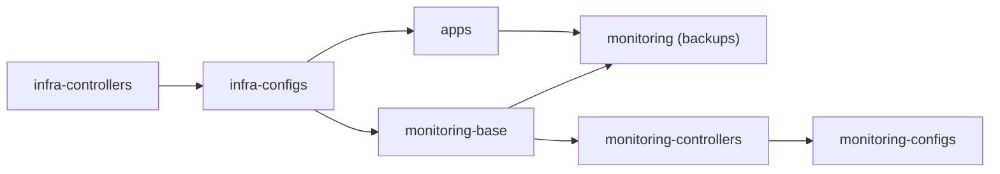

# Build Plan

Bare metal → running stack, in dependency order. Phases 0–3 are strict: each depends
on the one before. Phase 3.5 (data migration) and Phase 4 (workloads) come only after
the **validation gate** passes. Design rationale is in
[architecture.md](./architecture.md).

Legend: 🔧 manual one-time · ⚙️ scripted · 📦 GitOps (git commit). ⚑ = must-validate.

---

## Implementation status

This plan now describes both the target build and the implementation already committed
to this repo. Most of Phases 0-4 are represented as executable runbooks and/or Flux
manifests:

| Phase | Repo status | Remaining work |
|---|---|---|
| 0 — OS baseline | Host config and runbooks are present under `host/minis/` and `runbooks/phase0/`. | Manual BIOS/installer choices, router wildcard DNS, and any live-host revalidation after changes. |
| 1 — networking isolation | Host nftables, dnsmasq, chrony, sysctl config, Catalyst checklist, and validation runbooks are present. Host forwarding isolation, authoritative DHCP-only dnsmasq, and the sole deployed camera path were live-validated during Phase 4; the Amcrest camera receives reserved address `192.168.105.50`. | Add a reservation and repeat the camera-specific checks whenever another camera is provisioned; keep Catalyst/live config in sync. |
| 2 — k3s + Flux | k3s/age/SOPS/Flux bootstrap runbooks and `clusters/minis/flux-system` bootstrap output are present. The bootstrap helper enforces the rebuild reconciliation guards described below. The installer and validators pin the live baseline exactly at `v1.36.2+k3s1`. | Follow the attended [k3s update gate](./version-management.md#k3s-specific-update-gate) before changing the pin, then run the normal bootstrap health checks. |
| 3 — infrastructure | Flux Kustomizations, controller releases, ClusterIssuer, MetalLB, storage, scheduling, Tailscale, Intel GPU plugin, and encrypted infra secrets are committed. | Reconcile/validation gate on the live cluster after any manifest or secret changes. |
| 3.5 — data migration | Stopped-host archive copy runbooks are present; final copy validation and the quiesced cutover passed. | Historical migration path only. A current-state rebuild restores `/opt` from Restic as described below. |
| 4 — core workloads | Download stack, Plex, Seerr, RomM, Frigate, Home Assistant, MQTT, Z-Wave JS UI, and Zigbee2MQTT manifests plus validation/secret helper runbooks are present. The pre-existing workloads are validated on the live cluster, including Frigate Coral/QSV, authenticated MQTT, Home Assistant's Frigate integration, Z-Wave controller connectivity/device inclusion/HA integration, Zigbee device pairing/discovery/automation use, and HA's API-managed backup/restore path. Zigbee2MQTT and its monitoring exporter are reconciled and Ready. All repo-authored workload/helper image references are exact release-and-digest pins (or the documented Gluetun digest-only exception), enforced by CI and proposed for attended updates by Renovate. | Tune Frigate cameras. |
| 5 — observability + expansion | Direct-array and B2 backups passed live validation under backup-contract version 2, which blocks snapshots missing validated Plex, Frigate, Prowlarr, Radarr, Sonarr, Seerr, Home Assistant, RomM, or k3s SQLite exports. Fresh local and B2 backup/restore drills passed on 2026-08-22, including k3s integrity/schema/data and server-token-absence gates. The pinned kube-prometheus-stack and blackbox releases, probes/rules, Grafana access, Flux metrics, SOPS-safe Dead Man's Snitch heartbeat, and hosted Pushover actionable-alert route are deployed and passed live validation on 2026-07-20. Synthetic Pushover warning/critical firing and resolved notifications reached the iPhone; the external Snitch remains healthy. The nut-exporter workload, CP1500 dashboard, and critical on-battery rule passed live validation on 2026-07-25, including the controlled mains-loss/Pushover drill. Zigbee2MQTT's critical ingress, SLZB coordinator TCP, and MQTT-native bridge-health monitoring passed live validation on 2026-08-16. The direct-attached storage alerts now validate exact LVM/ext4 mount mappings and stalled md checks. Post-cutover backup/restore and observation gates passed on 2026-08-13. The standard-tier media resource tuning slice was deployed on 2026-08-13 and passed its seven-day gate on 2026-08-22. | Validate the new mdcheck cap during the next attended check, then tune Frigate before optional phase-two logs or deferred apps. |

## Fresh rebuild and disaster recovery

**Required order: suspend → restore → resume.**

The canonical executable procedure is
[`runbooks/disaster-recovery/`](../runbooks/disaster-recovery/). The stages below
explain its invariants; use the scripts for an actual recovery rather than translating
this prose into ad hoc commands.

The numbered phases preserve the original build history, but the repository now contains
live workload manifests. A fresh `flux bootstrap` starts reconciliation immediately;
bootstrapping the populated `main` branch without a guard can create stateful pods on an
empty `/opt` before application state is restored. Use this sequence for every rebuild.

### 1. Suspend in git before bootstrap

Restore the existing `age.key` from the password manager; do **not** generate a new key
for a repo whose SOPS files are already encrypted. The Phase 2 helper now rejects a
missing or mismatched rebuild key.

After the old cluster is offline, or after deliberately accepting that its Flux
reconciliation will pause, add this temporary field to both
`clusters/minis/apps.yaml` and `clusters/minis/monitoring.yaml`:

```yaml
spec:
  suspend: true  # temporary rebuild guard
```

Commit and push that guard to `main` **before** running `flux bootstrap`. The first
target blocks creation of all application workloads that use `/opt`; the second blocks
the legacy-named monitoring slice that owns the local and B2 Restic CronJobs. The
observability base/controllers/configs may reconcile because their persistent state is
throwaway TopoLVM scratch rather than restored `/opt` state.

`runbooks/phase2/05-flux-bootstrap.sh` enforces both committed guards. Do not rely on an
imperative `flux suspend` issued after bootstrap: reconciliation has already started by
then, so it leaves a race in which workloads can create or modify state.

### 2. Rebuild and validate infrastructure while workloads remain suspended

Run Phases 0-3. The Phase 3 reconcile and validation helpers accept `apps` as suspended
only when `monitoring` is suspended too. Confirm the live objects before restoring:

```bash
kubectl -n flux-system get kustomization apps monitoring \
  -o 'custom-columns=NAME:.metadata.name,SUSPENDED:.spec.suspend,READY:.status.conditions[-1].status'
kubectl get pods,cronjobs -A
```

Both Kustomizations must show `SUSPENDED=true`, and a fresh cluster must have no app
workload controllers or pods and no `restic-nas-backup` or `restic-b2-backup` CronJobs.
Flux suspension stops future reconciliation; it does **not** stop Deployments,
ReplicaSets, pods, Jobs, or CronJobs that already exist. If this is a partial rebuild
and any stateful workload or backup schedule already exists, remove the leftover
workload resources, quiesce storage, and prove no backup Job is active before touching
`/opt`.

### 3. Restore and validate state

First prove `/opt` is the expected btrfs LV and all direct-array mounts have the exact
devices/filesystems required by Phase 0; never restore into an unmounted directory on
the root filesystem. For a current-state rebuild, use the newest suitable validated
Restic snapshot from the direct backup LV, or B2 if the local repository is unavailable.
The historical Phase 3.5 archive copy is only for an intentional recovery from that old,
quiesced migration source.

Restore the snapshot's `/data/opt` live-state tree to a staging directory outside
`/opt`; the same-device `/opt/.snapshots` rollback tree is deliberately excluded from
Restic.
Validate every SQLite hot backup, replace its corresponding live-captured database in
staging, and remove stale WAL/SHM companions before copying the tree. Do not copy the
live-captured RomM MariaDB directory: initialize a fresh MariaDB data directory from
the snapshot's `/work/hot-dumps/romm/romm.sql` logical dump. Then copy the staged tree
to `/opt` with ownership, ACLs, xattrs, hard links, and numeric IDs preserved. Validate
the Home Assistant managed backup artifact as an independent application-aware fallback.
Keep every application stopped throughout this gate. The executable recovery scripts
enforce these database-specific steps.
Validate the staged contract-v2 k3s SQLite artifact independently, but leave it under
the root-only recovery staging tree. The default runner must never copy it into `/opt`
or replace the active k3s datastore; the optional attended procedure is documented in
[operations.md](./operations.md#optional-emergency-k3s-datastore-recovery).

The Phase 5 `05-validate-restore.sh` and `09-validate-b2-restore.sh` scripts are
representative restore drills into temporary volumes; they do **not** restore `/opt` and
are not substitutes for this full-state step. Before resuming, record the selected
snapshot ID and verify at minimum:

- `/opt` is still mounted from `/dev/vg0/opt`, not the root filesystem;
- expected app directories and ownership are present;
- restored SQLite/hot-backup integrity checks pass; and
- no application pod or Restic backup Job is running.

The backup job discovers SQLite databases with `.db`, `.sqlite`, and `.sqlite3`
suffixes, but it has a stricter required contract: both Plex library databases and the
primary Frigate, Home Assistant, Prowlarr, Radarr, Sonarr, and Seerr databases must
have fresh, validated hot backups. A new validated Home Assistant managed archive and a checked
RomM logical dump and a fresh, integrity-checked k3s SQLite online backup are also
mandatory. Restic does not start if any required export
fails. Full recovery rejects snapshots without the current contract version, exact
required inventory, Home Assistant archive, RomM dump, or k3s artifact before `/opt`
activation.

### 4. Resume in two commits

Remove `spec.suspend: true` from `clusters/minis/apps.yaml` only, commit and push, then
apply the git state and validate all Phase 4 workloads against the restored data:

```bash
flux reconcile kustomization flux-system --with-source
flux reconcile kustomization apps
./runbooks/phase4/00-preflight.sh
# Run the applicable Phase 4 validation helpers before continuing.
# Or run the canonical combined gate:
./runbooks/disaster-recovery/05-resume-apps.sh
```

Only after application validation passes, remove `spec.suspend: true` from
`clusters/minis/monitoring.yaml` in a second commit, push, and reconcile it:

```bash
flux reconcile kustomization flux-system --with-source
flux reconcile kustomization monitoring
./runbooks/phase5/00-preflight.sh
./runbooks/phase5/04-run-manual-backup.sh
./runbooks/phase5/05-validate-restore.sh
./runbooks/phase5/08-run-manual-b2-backup.sh
./runbooks/phase5/09-validate-b2-restore.sh
# Or run the canonical combined gate:
./runbooks/disaster-recovery/06-resume-monitoring.sh
```

Resume through git rather than `flux resume`; otherwise the committed
`spec.suspend: true` remains authoritative and Flux can reapply it.

## Direct-attached bulk storage migration (completed 2026-08-13)

The existing RAID6 enclosure was moved from Morpheus's SAS HBA to the installed LSI
9207-8e in `minis`, importing the existing mdadm/LVM/ext4 stack without copying or
reformatting data. The attended procedure, health gates, commands, rollback path, and
executed evidence are in the
[direct-attached storage migration runbook](./direct-attached-storage-migration.md).

All-disk SMART tests, pre-cutover backups/restores, exact mount identity, offline
filesystem checks, reboot assembly, read/write probes, and application cutover tests
passed. Morpheus's old mounts, exports, md checks, and automatic array assembly were
disabled, its recovery configuration was preserved off-host, and the machine was
retired on 2026-08-10. It remains powered off as a network-connected cold spare and
is not required for normal operation. Fresh local and B2 snapshots plus representative
restores passed on 2026-08-10. The initial consistency check finished with
`mismatch_cnt=0`, and more than 48 hours after that check completed showed no further
RAID, SAS, filesystem, or workload errors. These final gates closed on 2026-08-13.

The check did expose maintenance-induced I/O saturation and 122–245-second Frigate
filesystem stalls. On 2026-08-13, the committed deterministic timer drop-ins and a
check-only `50000` KiB/s cap were installed on `minis`; the cap resets to the system
default when each check window ends so recovery remains unrestricted. Per operator
decision, attended validation of the cap is deferred to the next check window.

This is a retrofit to the running production platform, not a new numbered build
phase. Resource tuning, Frigate tuning, optional centralized logs, and deferred apps
follow it.

Do not read a committed manifest as proof that the live cluster is healthy. Use the
phase validation scripts and gate below before declaring a phase complete.

---

## Phase 0 — OS baseline 🔧

**0.0 BIOS / firmware (one-time, before install).** These can't be set from the OS and
silently break passthrough if wrong:
- **VT-d / IOMMU — optional, not required for this build.** Plex and Frigate reach Quick
  Sync through Intel's GPU device plugin, and the Coral uses a `/dev/bus/usb` hostPath.
  These are plain device access, *not* DMA/PCI passthrough, so neither needs IOMMU.
  Leave VT-d on only if you want the option of true PCI passthrough later (e.g. a VM);
  nothing in the current container-first design depends on it. The `intel_iommu=on`
  cmdline in 0.3 is correspondingly optional.
- **iGPU enabled** (not disabled/headless) — Quick Sync transcoding needs `/dev/dri`
  to exist; confirm in 0.3.
- **Secure Boot off** (or be ready to enrol keys) — simplest path for any out-of-tree
  module; revisit only if you specifically want it on.
- Flash to a current MS-01 BIOS while you're in here — firmware fixes for this board's
  NIC/thermal behaviour ship regularly, and reflashing later means another reboot.

**0.1 Install Ubuntu 24.04 LTS** (server, no GUI; chosen over 26.04 — too new for
the one production node, and the MS-01's hardware is fully supported). No full-disk
encryption — unattended reboot after a UPS shutdown must work. No swap partition
(kubelet requires swap off). During partitioning, create the
layout from [architecture.md](./architecture.md#filesystem-and-volume-layout):
the ESP outside LVM (`/boot` lives on the `root` LV — GRUB reads it from LVM), then a
single LVM PV on the rest of the disk → VG `vg0` with LVs `root` 100 GB ext4 (`/`) ·
`var` 100 GB ext4 (`/var`) · `opt` 100 GB btrfs (`/opt`) · ~650 GB left
**unallocated in the VG**. Do *not* pre-create filesystems
for Frigate cache, SABnzbd staging, or qBittorrent staging — those are TopoLVM-provisioned PVCs in
Phase 4, carved from the VG free space.

Set the hostname to **`minis`** (`sudo hostnamectl set-hostname minis`) — the node
name k3s derives from it is load-bearing: every app PV pins `nodeAffinity` to
`kubernetes.io/hostname: minis`, so a mismatched hostname leaves every app PVC
`Pending` (see 2.1). Create a non-root sudo user (`charlie`). Harden SSH per
[`host/minis/etc/ssh/sshd_config.d/10-homelab.conf`](../host/minis/etc/ssh/sshd_config.d/10-homelab.conf):
key-only auth (`PasswordAuthentication no`) and no root login. Copy your key up
(`ssh-copy-id charlie@10.137.20.5`) **before** disabling passwords, then
`sudo systemctl restart ssh` and confirm a key login works in a second session before
closing the first — SSH is the sanctioned tunnel path for camera web UIs (1.1), so it
is reachable on the LAN and worth locking down. Tailnet application access is provided
separately by the in-cluster Tailscale Operator Connector.

**0.2 Static networking (NIC1 first).** Set NIC1 to a static IP via Netplan before
anything else so the address can't shift mid-bootstrap. The kernel auto-names the two
2.5GbE ports something like `enpXXs0` — the exact name is PCI-enumeration dependent and
can shift if hardware is rearranged, so identify the ports by **MAC**, not by name:
NIC1 = `38:05:25:35:fb:d3`, NIC2 = `38:05:25:35:fb:d2`. The netplan config pins these to
the friendly names **`lan0`** and **`cam0`** by MAC (`match`/`set-name`), which all later
config references — that rename is exactly what makes the names stable regardless of how
the kernel enumerated them. The rename lands on reboot — `netplan apply` cannot rename a
live, addressed link. The unused 10G SFP+ ports enumerate as `enpXs0f0np0`/`enpXs0f1np1`.
Also disable cloud-init's network rendering or it regenerates the installer's DHCP stub
on reboot.

→ Apply [`host/minis/etc/netplan/00-installer-config.yaml`](../host/minis/etc/netplan/00-installer-config.yaml)
(NIC1 static `10.137.20.5/24`; NIC2 `192.168.105.1/24` plus the `192.168.1.2/24`
factory-default-camera alias, with `optional: true` so a carrierless NIC2 can't block
boot) and [`host/minis/etc/cloud/cloud.cfg.d/99-disable-network-config.cfg`](../host/minis/etc/cloud/cloud.cfg.d/99-disable-network-config.cfg).
Netplan must be mode `600`. Then `sudo netplan generate && sudo netplan apply` and
confirm both interfaces are up.

**0.3 System prep + hardware checks.**
```bash
sudo apt update && sudo apt upgrade -y
sudo apt install -y curl git vim sqlite3 jq age nftables dnsmasq nut chrony mdadm lvm2 smartmontools
sudo timedatectl set-timezone America/Chicago   # set the HOST tz explicitly — Frigate event
                            #   timestamps and cross-log correlation depend on it; the default
                            #   is often UTC. (chrony in 1.3 serves time to cameras; this sets
                            #   the host's own clock display/zone.)
swapon --show               # MUST be empty — kubelet refuses swap. The installer often
                            #   creates /swap.img even with no swap partition; if present:
                            #   sudo swapoff -a && sudo rm /swap.img, then remove its
                            #   /etc/fstab line so it stays off across reboots.
ls -la /dev/dri/            # expect cardN + renderD128 (Quick Sync)
lsmod | grep i915           # i915 driver loaded; if not, add to /etc/modules + reboot
getent group render         # render GID — needed for the Plex pod. On this node: 993
rfkill block wifi           # WiFi (wlpXYs0) is unused; block it to shrink attack surface.
                            #   `rfkill` state persists across reboots on Ubuntu.
rfkill block bluetooth      # Bluetooth (hci0) is likewise unused — block it too.
```
Install [`host/minis/etc/sysctl.d/99-inotify.conf`](../host/minis/etc/sysctl.d/99-inotify.conf)
and run `sudo sysctl --system`; Phase 0.3 verifies `fs.inotify.max_user_watches=524288`
and `fs.inotify.max_user_instances=8192` after applying it.

IOMMU is **not** needed for this build — the iGPU and Coral are reached by hostPath device
access, not PCI passthrough (see 0.0). Only if you later add true PCI passthrough: set
`intel_iommu=on` in `GRUB_CMDLINE_LINUX` (`/etc/default/grub`), `sudo update-grub`, reboot —
and capture the grub file into `host/minis/etc/default/grub` so a restore stays a copy.

**0.4 Direct-attached bulk storage.** [`host/minis/etc/fstab`](../host/minis/etc/fstab) is the full fstab
from this host. The root/`var`/`opt` entries are LVM device paths the Phase 0.1 layout
reproduces, but the `/boot/efi` line carries a disk-specific UUID — reconcile it with
this disk (`blkid`) before use. Install the canonical `mdadm.conf`, update initramfs,
install the mdcheck timer and check-throttle service drop-ins, and append the four
UUID-based ext4 automounts on an existing install. Verify each mount resolves to its
expected `hoardvg` mapper and filesystem UUID. The service drop-ins cap scheduled
checks at `50000` KiB/s and restore the system default afterward. `nofail` and bounded
device/mount timeouts let the host boot with the enclosure absent. Completed downloads
remain under `/mnt/media`, so their handoff and the *arr library share one filesystem
for hardlink/atomic-move imports.

**0.5 UPS via NUT.** Apply the configs in [`host/minis/etc/nut/`](../host/minis/etc/nut/) (`nut.conf`,
`ups.conf`, `upsd.conf`, `upsmon.conf`, `upsd.users`; mode `640 root:nut`). The driver
(`usbhid-ups`) and model (`CyberPower CP1500`) are specific to this host's UPS. The
`upsmon`/`upsd` password is **redacted** in the repo — restore it from the password
manager, identical in both files (see [host/minis/README.md](../host/minis/README.md#nut-secret-note-important)).
Enable the stack (`sudo systemctl enable --now nut-driver-enumerator nut-server nut-monitor`).
NUT is host-level and must start **before** k3s so the clean-shutdown hook works even if
the cluster is degraded.

**0.6 udev rules for the Coral.** Apply
[`host/minis/etc/udev/rules.d/99-coral.rules`](../host/minis/etc/udev/rules.d/99-coral.rules) to give
the device stable, non-root permissions (`MODE=0666`, `GROUP=plugdev`), then
`sudo udevadm control --reload-rules && sudo udevadm trigger`. (The Coral enumerates
under two USB IDs — before and after its firmware loads — so the rule matches both; the
rule sets permissions, it does not create a symlink.) Frigate reaches the device via a
`/dev/bus/usb` hostPath in Phase 4c. The udev rule keeps host-side ownership stable, but
the Frigate container still runs privileged because the EdgeTPU delegate failed to
initialize in an unprivileged diagnostic pod.

**0.7 Router DNS.** Add the wildcard record `*.worm.run → 10.137.20.10` (the MetalLB
ingress IP from Phase 2.2, **not** the node's own `10.137.20.5`). Test true
wildcard support with a throwaway hostname before relying on it.

---

## Phase 1 — networking isolation 🔧

**1.1 Camera isolation (nftables).** Two hooks. The **forward** chain drops everything
routed to or from the segment (camera→internet, camera→LAN, LAN→camera). The **input**
chain drops everything a camera sends *to the host itself* except the few things the
segment legitimately needs — without it, the forward rules leave host services
(`k3s :6443` and `kubelet :10250`, both bound to `0.0.0.0` by default; `SSH :22`; and
every `hostNetwork` pod — Frigate, Home Assistant) reachable from a compromised
camera on `192.168.105.1`. RTSP needs no allow rule: Frigate (the host) *initiates* to
the camera, so the camera's replies are `established` and the host's own egress to the
camera is on the output hook, not forward.
```
# /etc/nftables.conf (excerpt)
# Scope teardown to OUR table only — do NOT use a top-level `flush ruleset` here.
# k3s/flannel/kube-proxy inject rules into the nat/filter/mangle tables at runtime;
# a global flush on `systemctl reload nftables` would wipe them and break pod
# networking until k3s re-syncs. This delete+recreate is idempotent and k3s-safe.
table inet camera_isolation {}
delete table inet camera_isolation
table inet camera_isolation {
  chain forward {
    type filter hook forward priority 0; policy accept;
    # Rate-limited log (no verdict → falls through), then an unconditional counter drop.
    # The log rule must NOT carry the drop verdict: if `limit` gated the drop, packets
    # over the rate would skip it and hit `policy accept`. Logging a compromised/chatty
    # camera's blocked traffic is the whole point of the segment; rate-limit so a camera
    # in a retry loop can't flood the journal.
    iifname "cam0" limit rate 10/minute log prefix "cam-drop-fwd-in "  # camera→anywhere
    iifname "cam0" counter drop
    oifname "cam0" limit rate 10/minute log prefix "cam-drop-fwd-out " # LAN→camera (host-only access)
    oifname "cam0" counter drop
  }
  chain input {
    type filter hook input priority 0; policy accept;
    iifname "cam0" ct state established,related accept   # RTSP/stream replies
    iifname "cam0" udp dport 67 accept                   # DHCP (dnsmasq)
    iifname "cam0" udp dport 123 accept                  # NTP (chrony, see 1.3)
    iifname "cam0" icmp type echo-request accept         # ping diagnostics ONLY (v4); a broad
                                                            #   `ip protocol icmp` allow would also let a
                                                            #   camera send the host ICMP redirects. Host→camera
                                                            #   ping replies still pass via `established`.
    iifname "cam0" udp dport 53 counter drop             # expected camera DNS retries; keep blocked but quiet
    iifname "cam0" tcp dport 53 counter drop
    iifname "cam0" limit rate 10/minute log prefix "cam-drop-input "  # all other camera→host
    iifname "cam0" counter drop
  }
}
```
The camera segment is **IPv4-only**. The `inet` table covers both families, and the
`icmp type echo-request` diagnostic allow is IPv4-only — ICMPv6 (router/neighbor
discovery) from a camera falls to the final drop. To remove the IPv6 surface entirely
rather than rely on that, disable it on NIC2:
```
# /etc/sysctl.d/99-camera-no-ipv6.conf
net.ipv6.conf.cam0.disable_ipv6 = 1
```
`sudo sysctl --system` to apply.
`policy accept` on both chains is intentional (see [architecture.md](./architecture.md#networking));
the explicit drops do the work without breaking k3s's own nft chains. Enable nftables.
⚑ From a device on the camera segment, confirm you **cannot** ping `8.8.8.8` or any
`10.137.20.0/24` host, and that ICMP to the host (`192.168.105.1`) still **succeeds**
(the diagnostics allow). **Caveat — the forward-chain drop is not actually exercised at
this stage:** `net.ipv4.ip_forward` is `0` on stock Ubuntu and only gets flipped to `1`
by k3s in Phase 2, so right now the host won't route camera→internet/LAN regardless of
nftables. DHCP advertises `192.168.105.1` as a router for camera firmware compatibility,
but nftables still makes it a dead end for forwarded traffic. The "cannot ping
`8.8.8.8`" check therefore passes trivially and `cam-drop-fwd-*` will never log here — only
the **input** chain is genuinely testable now. The forward drop must be re-validated at the
gate (post-k3s) from a test device with a manual IP **and** a manual gateway of
`192.168.105.1`; see the gate. To prove the input chain actually drops host services, test a
port with something **listening** behind it: SSH (`nc -vz 192.168.105.1 22`) is up from
Phase 0 and must **fail**. The other host services don't exist yet — k3s `:6443` lands
in Phase 2, Frigate `:5000` in Phase 4 — so `nc` to them fails because nothing listens,
not because the firewall blocks it; that's not a real test. For a definitive check now,
run a throwaway listener bound to all interfaces on the host
(`python3 -m http.server 8000`) and confirm the camera segment cannot reach it, then
stop it. **Re-validate `:6443` (Phase 2) and `:5000` (Phase 4) once those services are
actually up** — see the validation gate.
After the rules are live, confirm the drop logging works: trigger a blocked connection
from the segment and watch for the `cam-drop-*` prefixes in `journalctl -k -f`.

**1.1b Intra-segment isolation is a switch responsibility, not the host's.** These rules
only govern traffic that reaches the node; two cameras on the same L2 segment talk
directly through the switch and never hit it. A compromised camera could pivot to its
peers unless the switch isolates the camera ports from each other. The camera segment
runs on a **Cisco Catalyst 3850**, which supports this — configure **protected ports**
(`switchport protected` on each camera access port, plus `switchport block unicast`/
`block multicast` so unknown-unicast/flood traffic isn't leaked between them). A blanket
PVLAN is the heavier alternative if you later need more than protected ports gives.
**Leave the host uplink port _unprotected_** — protected ports can't talk to each other, so
protecting the uplink would kill host↔camera RTSP. (Protected ports also only isolate within
a single switch/stack; if cameras ever span a second switch over a trunk, you'd need PVLANs.
The segment is a single 3850 today, so protected ports suffice.)

⚑ This is a **blocker, not a follow-up**: network isolation must be complete before any
camera is connected and before Frigate goes live (Phase 4c). Validate by attempting a
ping or port scan **between two cameras on the segment** — it must fail. Until this is
done the posture is "no internet, no LAN reach, but cameras are *not* isolated from one
another," which is not an acceptable state to run cameras in.

LAN→camera access (e.g. a camera web UI for setup) goes through the node, since direct
forwarding is dropped. Tunnel the camera's HTTP port to your workstation over SSH:
```bash
# reach camera 192.168.105.101's web UI at http://localhost:8080 on your laptop
ssh -L 8080:192.168.105.101:80 charlie@10.137.20.5
```
The host can route to the camera segment (it owns `192.168.105.1`); only *forwarded*
LAN→camera traffic is blocked, so the SSH-forwarded connection originating on the host
works. Tear down the tunnel when done — no standing rule is added.

**Provisioning a factory-default / static camera.** New Amcrest cameras default to DHCP
and land on a `192.168.105.x` lease (reach them via the tunnel above). But a reset, a
static-default firmware, or a second-hand camera previously set static will instead sit
at the factory `192.168.1.108` and ignore DHCP. NIC2 carries a secondary address
(`192.168.1.2/24`, set in 0.2) precisely to reach those without a bench network — tunnel
to the default address, enable DHCP + set NTP/credentials, then it rejoins the `105`
segment:
```bash
ssh -L 8080:192.168.1.108:80 charlie@10.137.20.5   # camera default UI at localhost:8080
```
This is a one-at-a-time recovery path (every factory camera is `192.168.1.108`), not the
normal flow. The nftables rules need no change — they are `iifname "cam0"`-scoped, so
the alias subnet is already covered.

**1.2 Camera DHCP (dnsmasq).** Bind dnsmasq to NIC2 and serve `192.168.105.0/24`
(host-level service, not a pod). Give cameras stable leases so Frigate can target
known addresses. `sudo systemctl enable --now dnsmasq` so it survives a reboot.
(`port=0` means dnsmasq runs no resolver, so it does **not** collide with
`systemd-resolved` on `:53` — no need to disable resolved.)
```
# /etc/dnsmasq.d/cameras.conf (excerpt)
interface=cam0
bind-dynamic            # binds as the interface appears; survives a boot with no
                        # carrier on NIC2 (it's optional:true). bind-interfaces would
                        # fail to start if no camera is connected at boot.
port=0                  # DHCP only — no DNS. Frigate targets cameras by IP, and a
                        # resolver here would be an outbound beacon path for a
                        # compromised camera (queries forwarded via the host's WAN).
dhcp-range=192.168.105.100,192.168.105.199,12h  # DYNAMIC pool only; static reservations
                        # (dhcp-host) live in a dedicated .50-.99 block, so a pinned camera IP
                        # can't collide with a transient lease. Split fixed up front — once cameras
                        # are pinned their IPs are baked into NTP/Frigate config.
dhcp-authoritative      # sole DHCP server on an isolated segment; speeds up leases
# Only the 105 subnet gets a range. NIC2's 192.168.1.2/24 alias (for reaching a
# factory-default camera at .108, see 1.1) is intentionally NOT served DHCP — it's a
# manual provisioning path, not part of the live segment.
# Hand cameras the host as their NTP server (option 42) — BEST EFFORT ONLY. Amcrest/
# Dahua cameras generally ignore option 42 and use the NTP server set in their own web
# UI, so this is a backstop, not the source of truth; the authoritative NTP config is
# set per-camera in 1.3. Some camera firmware repeatedly renews DHCP if no router is
# advertised, so hand out the host's camera-side address as the gateway. nftables still
# drops all forwarded traffic entering/leaving cam0, so this does not create an internet
# or LAN path. DNS remains deliberately empty: serving DNS here would be an outbound
# beacon path for a compromised camera.
dhcp-option=option:router,192.168.105.1
dhcp-option=option:dns-server
dhcp-option=option:ntp-server,192.168.105.1
# dhcp-host=AA:BB:CC:DD:EE:FF,192.168.105.51   # pin per-camera in the static .50-.99 block
```
⚑ Confirm a DHCP client receives a lease in range. Real cameras aren't connected yet at
this stage (that's gated on the switch isolation in 1.1b), so validate with a **test
laptop** plugged into the camera segment — it should get a `192.168.105.100–.199` lease, the
host (`.1`) as both its advertised gateway and NTP server, and **no DNS server**. The
gateway is present for camera firmware compatibility; the nftables forward chain must
still prevent that route from reaching the LAN or internet.

> **Required for every camera before adding it to Frigate (4c).** Stable leases require
> explicit `dhcp-host` MAC reservations; plain dynamic leases can reshuffle after a
> lease-DB loss or long outage. The deployed Amcrest is pinned at `.50`. For each
> additional camera, collect its MAC during provisioning, add a reservation in the
> `.50-.99` static block, restart dnsmasq, and confirm the camera holds its reserved IP
> before adding that address to `apps/frigate/config.yml`.

**1.3 Camera NTP (chrony).** Cameras have no internet, so they need a local time source
or their clocks drift and recording timestamps/event correlation in Frigate go wrong.
Serve NTP from the host with **chrony** — install it in 0.3 (it supersedes Ubuntu
24.04's default `systemd-timesyncd`, which is an SNTP *client* only and cannot serve
the segment; confirm with `timedatectl` / `chronyc sources` that chrony, not timesyncd,
is now the active daemon):
```
# /etc/chrony/conf.d/cameras.conf
# Answer NTP from the camera segment.
allow 192.168.105.0/24
# Serve the host's own clock as a fallback so the segment stays served during a WAN
# outage (else chrony goes unsynced and REFUSES to serve, and the cameras have no
# other time source → they drift).
local stratum 10
```
chrony listens on all interfaces (default) — we deliberately do **not** `bindaddress`
to NIC2. Binding to `192.168.105.1` would require that address to exist on `cam0`
when chrony starts, but NIC2 is `optional: true` and may have no carrier at boot, so
the bind could fail and silently leave the segment unserved (dnsmasq sidesteps this with
`bind-dynamic`; chrony has no lazy-bind equivalent). Listening everywhere is harmless:
`allow 192.168.105.0/24` only authorizes the camera subnet, so a request arriving on the
LAN reaches the socket but is refused — not worth the boot-order fragility of binding. The matching `udp dport 123` allow rule is already in the 1.1 input chain.
`sudo systemctl enable --now chrony` (then restart to pick up the drop-in). ⚑ From a
camera-segment device, `chronyc -h 192.168.105.1 tracking`
(or any NTP query) succeeds.

**Configure NTP on each camera directly — this is the source of truth, not DHCP.** In
the Amcrest web UI: Setup → System → General → Date & Time → enable NTP, set the server
to `192.168.105.1`. Without internet the cameras have no other time source, and they
generally ignore the DHCP option 42 hint, so a misconfigured camera will silently drift
and corrupt Frigate event timestamps. ⚑ After setup, confirm each camera's clock is in
sync (visible in the camera UI / on Frigate's first snapshots).

**1.4 Direct-storage spot check.** ⚑ Verify `/mnt/media` resolves to
`/dev/mapper/hoardvg-medialv`, ext4 UUID `0a94d86c-76a0-44b5-bc52-930d97ab155f`,
then run the bounded 256 MiB write/read/delete probe in
`runbooks/phase1/04-direct-storage-throughput.sh`. This catches missing automounts,
root-directory fallthrough, wrong device mappings, and immediate I/O failures before
workloads depend on the array.

---

## Phase 2 — k3s + Flux bootstrap prerequisites ⚙️

This phase is intentionally small. The only imperative cluster writes are the k3s
install, the `flux-system/sops-age` Secret, and `flux bootstrap`. Everything else
that changes Kubernetes state is reconciled by Flux from git in Phase 3.

On a rebuild, restore the existing age private key and complete the
[suspend guard](#1-suspend-in-git-before-bootstrap) before step 2.5. The repo is no
longer an empty scaffold, so this is a required safety gate rather than optional
maintenance posture.

**2.1 Install k3s.**

The executable helper and command below pin the validated live baseline exactly at
`v1.36.2+k3s1`. The helper also rejects an already-active server on a different
release rather than silently treating it as validated. Changing this pin is host
maintenance governed by [version-management.md](./version-management.md#k3s-specific-update-gate),
not authorization to reinstall the live node solely for validation.

```bash
sudo install -D -o root -g root -m 600 \
  host/minis/etc/rancher/k3s/config.yaml \
  /etc/rancher/k3s/config.yaml

curl -sfL https://get.k3s.io | \
  sudo env INSTALL_K3S_VERSION=v1.36.2+k3s1 sh -s - \
  --disable traefik --disable servicelb \
  --node-name minis          # node name drives the kubelet-set kubernetes.io/hostname
                             #   label the PV nodeAffinity pins to; requires hostname=minis (0.1).
                             #   Do NOT override that label via --node-label — it conflicts.
kubectl get nodes            # minis Ready
```

The canonical k3s config passes
`terminated-pod-gc-threshold=20` to kube-controller-manager. The upstream default of
12,500 is excessive for this small cluster and leaves terminal Pods from hardware
device-plugin admission races around effectively forever. PodGC applies cluster-wide
and removes the oldest `Failed` or `Succeeded` Pods once their total exceeds 20, so
old Pod logs are intentionally bounded too.

**2.2 age keypair.**
```bash
age-keygen -o age.key         # copy the public key from stdout
# >>> back up age.key to the password manager NOW, before continuing <<<
```

**2.3 Store the private key in-cluster.**
```bash
kubectl create namespace flux-system
kubectl create secret generic sops-age \
  --namespace flux-system --from-file=age.agekey=age.key
```

**2.4 `.sops.yaml`** at the repo root:
```yaml
creation_rules:
  - path_regex: .*\.yaml
    encrypted_regex: ^(data|stringData)$
    age: <YOUR_AGE_PUBLIC_KEY>
```

**2.4.1 Install the Flux CLI.**
```bash
curl -s https://fluxcd.io/install.sh | sudo bash
flux version --client
```

**2.5 Bootstrap Flux** (creates the repo if absent — **private** by default — commits
Flux manifests, generates a deploy key, and starts reconciling). `--private` is the
default for `flux bootstrap github`; it's passed explicitly here so the intent is
obvious and a future edit can't silently flip it to public. For this populated repo,
both `apps` and the `monitoring` backup slice must already have committed
`spec.suspend: true`; the executable helper refuses to bootstrap without them:
```bash
flux bootstrap github \
  --owner=sandersch --repository=home \
  --branch=main --path=clusters/minis --personal --private
```

---

## Phase 3 — GitOps-managed cluster infrastructure ⚙️

Phase 3 reconciles cluster infrastructure after bootstrap. On the original build it
was the first normal Flux commit; on a rebuild, the infrastructure is already in git
and `apps` plus the backup slice remain suspended through the restore gate. Do not
install controllers with imperative Helm commands; Flux owns the desired state as
`HelmRepository`, `HelmRelease`, and Kubernetes manifests.

**3.1 Commit the ordered Flux skeleton** — see
[structure in AGENTS.md](../AGENTS.md#repository-structure):
`clusters/minis/{kustomization.yaml,infra-controllers.yaml,infra-configs.yaml,apps.yaml}`,
`infrastructure/{controllers,configs,monitoring}`, and
`apps/{media,frigate,home-assistant,mqtt}`.
The Flux target paths now contain real manifests rather than only placeholders:
`infrastructure/controllers`, `infrastructure/configs`, and `apps` each have a
`kustomization.yaml` and are included from `clusters/minis/`.

Use separate Kustomizations so CRD-backed config does not race the controllers that
install those CRDs:

- `infra-controllers` → `./infrastructure/controllers`, `wait: true`
- `infra-configs` → `./infrastructure/configs`, `dependsOn: infra-controllers`,
  `wait: true`, SOPS decryption enabled
- `apps` → `./apps`, `dependsOn: infra-configs`, SOPS decryption enabled
- `monitoring-base` → `./infrastructure/monitoring/base`,
  `dependsOn: infra-configs`; owns the namespace and bootstrap secrets
- `monitoring-controllers` → `./infrastructure/monitoring/controllers`,
  `dependsOn: monitoring-base`; installs the Prometheus Operator CRDs and stack
- `monitoring-configs` → `./infrastructure/monitoring/configs`,
  `dependsOn: monitoring-controllers`; applies blackbox, probes, rules, and routing
- `monitoring` → `./infrastructure/monitoring`, `dependsOn: apps` and
  `monitoring-base`; this legacy-named slice owns the validated backup resources

The resulting graph keeps metrics and alerting independent of application readiness,
while backups cannot be blocked by a monitoring-controller failure:



The files under `clusters/minis/` are the canonical Kustomization specs; keep the graph
here descriptive rather than maintaining a second inline copy that can drift.

From here: write a Secret, `sops --encrypt --in-place secret.yaml`, commit — Flux
decrypts at apply time.

**3.2 Controllers in `infrastructure/controllers/`.** Commit namespaces,
`HelmRepository` objects, `HelmRelease` objects, and Flux-managed upstream manifests for:

- MetalLB
- ingress-nginx
- cert-manager, with CRDs installed by the Helm release
- Tailscale operator and its SOPS-encrypted OAuth Secret, which must reconcile in the
  controller slice before the HelmRelease can become ready
- TopoLVM, with lvmd embedded in the node DaemonSet, device-class → `vg0`, and a
  `spare-gb` reserve
- Intel GPU device plugin, configured with two shared i915 allocations for Plex and
  Frigate Quick Sync access, and applied from the pinned upstream source in
  `infrastructure/controllers/intel-gpu-plugin`

**3.3 Config in `infrastructure/configs/`.** Commit the CRD-backed resources and
cluster-wide config that depend on the controllers:

- MetalLB `IPAddressPool` + `L2Advertisement`. The pool is `10.137.20.10/32`,
  distinct from the node's own `10.137.20.5`; MetalLB must own the address it
  announces.
- ingress-nginx LoadBalancer configuration that receives `10.137.20.10`
- cert-manager Let's Encrypt DNS-01 `ClusterIssuer` solving via **Google Cloud
  DNS**: the solver's `cloudDNS.project` names the GCP project hosting the zone,
  and `cloudDNS.serviceAccountSecretRef` points at an encrypted Secret holding a
  service-account key JSON (DNS Administrator on that project). Per cert-manager's
  CloudDNS DNS-01 guide: https://cert-manager.io/docs/configuration/acme/dns01/google/
- Tailscale Connector and split-DNS configuration needed for Tailnet access; the
  operator OAuth Secret itself lives with the controller slice above
- `homelab-critical` and `homelab-standard` `PriorityClass` objects
- `local-nvme`, non-default `local-path`, and `topolvm-scratch` `StorageClass` objects

Configure **split DNS** in the Tailscale admin console so `*.worm.run` resolves through
the advertised router DNS route (`10.137.20.1/32`) to the advertised MetalLB ingress
route (`10.137.20.10/32`). The Connector implements Tailnet access without a host
Tailscale daemon and intentionally does not advertise the full server VLAN or the node
address. Administrative kubeconfig contexts continue to target the node API on the LAN.

---

## ✅ Validation gate

Do **not** deploy or cut over Phase 3.5/4 workloads on the live cluster until all of
these are green:

- [ ] `kubectl get nodes` → `minis Ready`
- [ ] `flux get kustomizations` → `flux-system`, `infra-controllers`, and
      `infra-configs` Reconciled. On the original/live path, `apps` is Reconciled;
      on a rebuild, `apps` and `monitoring` both remain suspended until `/opt` is
      restored and validated
- [ ] `flux get helmreleases -A` → MetalLB, ingress-nginx, cert-manager, Tailscale
      operator, and TopoLVM Ready
- [ ] `flux get kustomization intel-gpu-plugin -n flux-system` → Ready, and
      `kubectl get node minis` reports allocatable `gpu.intel.com/i915=2`
- [ ] `kubectl get crd` confirms MetalLB, cert-manager, Tailscale, and TopoLVM CRDs
      exist before config resources apply
- [ ] ingress-nginx + cert-manager pods Running; ClusterIssuer Ready
- [ ] `kubectl get svc -n ingress-nginx` shows LoadBalancer IP `10.137.20.10`
- [ ] Direct-attached `/mnt/media` has the expected LVM/ext4 identity and is readable from a test pod
- [ ] `/dev/dri/renderD128` visible in a **privileged test pod** (Quick Sync path)
- [ ] Coral device visible in a privileged test pod
- [ ] Camera segment **cannot** reach internet or LAN (ping `8.8.8.8` + a `10.137.20.x` host both fail). **Run this with k3s up (ip_forward=1) from a test device with a static IP + manual gateway `192.168.105.1`** — otherwise the forward drop is untested (see 1.1) and `cam-drop-fwd-*` should appear in the journal
- [ ] Camera segment **cannot** reach host services — `nc -vz 192.168.105.1 22` fails (SSH is listening, so this is a real test); `:6443` now also fails with k3s up. Re-check `:5000` after Frigate (Phase 4c)
- [ ] `cam-drop-*` log entries appear in `journalctl -k` when a blocked connection is attempted from the segment
- [ ] Two cameras on the segment **cannot** reach each other (switch protected ports, 1.1b)
- [ ] dnsmasq issues a camera lease in range
- [ ] Every real camera has a `dhcp-host=<mac>,192.168.105.<50-99>` reservation and
      keeps the same IP across a dnsmasq restart before Frigate goes live
- [ ] Camera segment gets NTP from the host (`192.168.105.1`); each camera's own NTP is set to `192.168.105.1` and its clock is in sync
- [ ] Tailscale operator connected; `*.worm.run` resolves over the Tailnet
- [ ] SOPS decrypt works (reconcile an encrypted Secret and confirm Flux applies it
      without plaintext in git)
- [ ] NUT active and reporting battery status

The device-passthrough items are far easier to debug now, without app complexity on
top.

---

## Phase 3.5 — app data migration 🔧

This is the historical migration path, not the normal recovery source for a current
rebuild. A current rebuild follows
[suspend → Restic restore → ordered resume](#fresh-rebuild-and-disaster-recovery)
instead.

For an intentional recovery from the old stopped-host archive, this phase is only the
pre-work copy after the validation gate. Copy existing
Plex/Radarr/Sonarr/Prowlarr state from the old stack to `/opt/...` on `minis` while
the old stack continues serving. The migrated workloads are deployed in Phase 4 using
this copied data; cutover does not happen here.

Copy procedure details (VACUUM, rsync flags, ownership, and URL notes) are in
[migration-runbook.md](./migration-runbook.md).
Executable host-side scripts for the stopped-host archive copy live in
[`runbooks/phase3.5`](../runbooks/phase3.5/).

- **Migrate:** Plex (metadata/DB), Radarr, Sonarr, Prowlarr.
- **Fresh installs, no migration:** Seerr, RomM, Home Assistant, Frigate.
- Keep the old stack intact for Phase 4 validation and rollback.

---

## Phase 4 — core workloads 📦

GitOps from here. Every pod sets resource requests/limits + a priorityClassName.
Deploy workloads with direct bulk-storage mounts read-only initially where practical. Validate
the copied app state and hardware paths first; only after validation do you cut over,
flip bulk-storage writes on, and run the final rsync for app-config changes made during the
parallel run. All four UUID-based bulk-storage mounts are installed in Phase 0.4.

**4a — download pod: Gluetun + Mullvad + SABnzbd + qBittorrent + *arr (deploy first).** One pod in
`media`: Gluetun plus SABnzbd, qBittorrent, Prowlarr, Radarr, and Sonarr sharing its
network namespace. Intra-stack calls are `localhost:<port>`; everything outside the
pod uses the Gluetun Service. ⚑ Confirm the egress IP from inside the pod equals the
VPN exit IP before configuring indexers/downloads, then validate *arr history and
test download flows. Pattern below.

Status: live validation passed on 2026-07-18. The VPN-protected download stack and
its download/import workflow are operational.

Then, in parallel once VPN is validated:

**4b — Plex** (standard/burstable). Quick Sync is exposed through Intel's GPU device
plugin by requesting `gpu.intel.com/i915: "1"`; keep the render supplemental group for
host compatibility, but do not mount `/dev/dri` directly. Media is mounted from
`/mnt/media` (direct ext4 automount from Phase 0.4); metadata lives under
`/opt/plex`. ⚑ Confirm the migrated library/metadata is intact, then run a 1080p
transcode and confirm GPU use with `intel_gpu_top` on the host.

Status: live validation passed on 2026-07-18. The migrated Plex server, media
library, and Quick Sync transcoding path are operational.

**4c — Frigate** (critical scheduling/preemption priority). `hostNetwork: true` so RTSP
connections to cameras originate from the host (source IP `192.168.105.1`) without
passing through the forward chain — this is what makes the nftables camera isolation work. Quick Sync is
exposed through Intel's GPU device plugin by requesting `gpu.intel.com/i915: "1"`;
Coral USB uses a `/dev/bus/usb` hostPath with a privileged container. DB on
`/opt/frigate`, cache on a `topolvm-scratch` PVC (50 Gi ext4 LV), recordings via
hostPath to `/mnt/frigate`, and `config.yml` from the generated `frigate-config`
ConfigMap. The `frigate-config-pvc` still backs the rest of `/config` for Frigate
state. ⚑ Before Frigate goes live, confirm every real camera has a stable
`.50-.99` `dhcp-host` reservation across a dnsmasq restart; then verify cameras remain
unreachable from the internet.

Status: basic Frigate validation passed on 2026-06-30 local time. The
`amcrest_105_50` camera is live, the Coral detector reports `TPU found` and active
inference, and ffmpeg is using Intel QSV via `/dev/dri/renderD128` for the detect
stream. Next Frigate work is operational tuning: motion masks, zones, object filters,
and retention.

**4d — remaining stack.** Seerr (pointed at the *arrs via the Gluetun Service),
RomM, Home Assistant (`hostNetwork: true` for mDNS/Zeroconf discovery), Z-Wave JS
UI, and Zigbee2MQTT. The network-attached SLZB-MRW10U exposes Z-Wave at
`tcp://slzb-mrw10u.iot.matrix:6638` and its TI Zigbee radio at port `7638`; neither
workload needs USB passthrough.

Current repo state: Seerr and RomM manifests are committed under `apps/media/`; MQTT
is committed under `apps/mqtt/`; Home Assistant manifests are committed under
`apps/home-assistant/` with host networking, local-NVMe config storage, ingress, and
first-boot reverse-proxy and automation configuration seeding. Z-Wave JS UI is
reconciled there as the cluster-internal Home Assistant Z-Wave server.
Zigbee2MQTT manifests are committed under `apps/zigbee2mqtt/` with retained local
state, a SOPS-encrypted dedicated Mosquitto account/frontend token, Home Assistant
MQTT discovery, and a fresh channel 15 network seed. The workload and monitoring
exporter are reconciled and Ready, and the critical ingress and MQTT-native health
paths passed live validation on 2026-08-16. Zigbee devices have also been paired,
discovered through Home Assistant's existing MQTT integration, and used successfully
in Home Assistant automations.

Status: Seerr and RomM live validation passed on 2026-07-18. Seerr is connected to
Plex and the download stack; RomM's local state, MariaDB sidecar, service path, and
direct-attached library are operational. Home Assistant's authenticated API-managed backup
plus representative restore validation passed as part of Phase 5. Its MQTT and HACS
Frigate integrations passed live validation on 2026-07-18, including authenticated
broker traffic, Frigate availability, entity registration, and a real person event.
Z-Wave live validation passed on 2026-08-16: Z-Wave JS UI reached the SLZB controller,
the Home Assistant WebSocket integration connected, and an included device exposed
entities in Home Assistant.

---

## Phase 5 — observability + expansion 📦

- **Phase one metrics and alert pipeline (deployed and live-validated 2026-07-20):** pinned
  **kube-prometheus-stack** (Prometheus + Grafana + Alertmanager), pinned
  **prometheus-blackbox-exporter**, internal HTTPS/TCP probes, Flux controller metrics,
  operational alert rules, an external **Dead Man's Snitch** Watchdog route, and
  hosted **Pushover** routing for actionable alerts. Both integrations were activated
  through SOPS helpers in `runbooks/phase5`. Validation covered Flux/Helm readiness,
  bound PVCs, Grafana's HTTPS login path, every configured scrape target and blackbox
  probe, rule evaluation without errors, successful Watchdog delivery, and synthetic
  Pushover warning/critical firing and resolved notifications delivered to the iPhone.
- **Phase one UPS slice deployed and live-validated 2026-07-25:** a hardened
  **nut-exporter** Deployment polls the host `upsd` anonymously, a ServiceMonitor
  exposes CP1500 telemetry, Grafana gets a focused UPS dashboard, and one minute on
  battery raises a critical Pushover-routed alert. Validation covered the exporter,
  Prometheus target and rule, Grafana dashboard, and operator-gated mains-loss drill;
  the critical firing and quiet recovery notifications reached the iPhone.
- **Zigbee2MQTT monitoring live-validated 2026-08-16:** the critical HTTPS and SLZB
  coordinator TCP blackbox paths plus MQTT-native bridge health passed the repeatable
  Phase 5 gate. The exporter target was healthy, retained bridge state was online,
  MQTT was connected, health publication was fresh, both probes succeeded, and the
  bridge-health and shared endpoint rules were healthy with no active Zigbee2MQTT
  alert.
- **Optional phase two:** **Loki + Grafana Alloy** for centralized logs. It is not
  required for phase-one monitoring; logs remain available through Kubernetes,
  Pushover handles actionable phone notifications, and Dead Man's Snitch provides the
  independent off-node failure signal.
- **Restic CronJobs** for backups — the implementation under
  `infrastructure/monitoring` and `runbooks/phase5` has nightly direct-array `/opt`
  backups to `/mnt/backups/opt` plus an independent weekly Backblaze B2 repository.
  The initial B2 backup, repository check, and local-volume-free restore drill passed on
  2026-07-18. The nightly local and first naturally scheduled weekly B2 runs both
  completed successfully on 2026-07-19. Backup-contract version 2 passed fresh
  attended local and B2 backup/restore drills on 2026-08-22. Local snapshot
  `731326fa` and B2 snapshot `fe10c1ff` covered all eight mandatory application SQLite
  exports, the Home Assistant archive, a 32-table RomM import, validated k3s SQLite
  integrity/schema/data, and the absence of any server-token artifact.
  Design and operating notes are in
  [operations.md](./operations.md#backups).
- **Immich (later)** — coordinate the initial import during a quiet window and watch
  memory (its ML container is the one big consumer). Originals on the direct bulk array; thumbs/ML on
  `/opt/immich`; benefits from Quick Sync.
- **Media resource tuning deployed 2026-08-13; seven-day gate passed 2026-08-22:** the reusable
  Phase 5 resource audit captured the unchanged 14-day baseline, then the standard-tier
  media containers were right-sized to `1.775` requested CPU cores and `4320Mi`
  requested memory. Frigate, Home Assistant, MQTT, monitoring, and deferred apps were
  unchanged. The seven-day closeout reproduced the exact reservation totals, recorded
  zero OOM events, kept every memory maximum below 85% of its limit, and kept every
  container below the 5% throttling threshold, with restart and functional checks
  healthy. Seerr was nearest the throttling threshold at `4.264%`; it passes, but
  remains worth watching in later audits.

---

## Storage pattern

Two reusable shapes: **app state** (snapshotted `/opt` subdirectory, static
hostPath PV + PVC) and **scratch** (TopoLVM-provisioned ext4 LV, PVC only).
Adding a new app = copy the right one, change names — no SSH; the app-state
directory is auto-created, the scratch LV is provisioned on schedule.

```yaml
# infrastructure/configs/storageclass.yaml — once, cluster-wide
apiVersion: storage.k8s.io/v1
kind: StorageClass
metadata: { name: local-nvme }
provisioner: kubernetes.io/no-provisioner
volumeBindingMode: WaitForFirstConsumer
reclaimPolicy: Retain
---
# Strips the default annotation from k3s's built-in local-path StorageClass.
# Without any default, PVCs that omit storageClassName stay Pending rather than
# silently landing on /var/lib/rancher/k3s/storage.
apiVersion: storage.k8s.io/v1
kind: StorageClass
metadata:
  name: local-path
  annotations:
    storageclass.kubernetes.io/is-default-class: "false"
provisioner: rancher.io/local-path
reclaimPolicy: Delete
volumeBindingMode: WaitForFirstConsumer
---
# Scratch class — TopoLVM provisions a thick ext4 LV from vg0 free space per PVC.
# The LV is a kernel-enforced size cap (unlike hostPath); growing it is a PVC edit.
apiVersion: storage.k8s.io/v1
kind: StorageClass
metadata: { name: topolvm-scratch }
provisioner: topolvm.io
parameters: { "csi.storage.k8s.io/fstype": "ext4" }
volumeBindingMode: WaitForFirstConsumer
reclaimPolicy: Delete
allowVolumeExpansion: true
---
# apps/<ns>/<app>/pv.yaml
apiVersion: v1
kind: PersistentVolume
metadata: { name: <app>-config-pv }
spec:
  capacity: { storage: 5Gi }
  accessModes: [ReadWriteOnce]
  persistentVolumeReclaimPolicy: Retain
  storageClassName: local-nvme
  hostPath: { path: /opt/<app>/config, type: DirectoryOrCreate }
  claimRef:                              # pins this PV to exactly one PVC; prevents
    namespace: <ns>                      # the scheduler binding it to a different app
    name: <app>-config-pvc
  nodeAffinity:
    required:
      nodeSelectorTerms:
        - matchExpressions:
            - { key: kubernetes.io/hostname, operator: In, values: [minis] }
---
# apps/<ns>/<app>/pvc.yaml
apiVersion: v1
kind: PersistentVolumeClaim
metadata: { name: <app>-config-pvc, namespace: <ns> }
spec:
  storageClassName: local-nvme
  accessModes: [ReadWriteOnce]
  volumeName: <app>-config-pv           # pins this PVC to the matching PV by name
  resources: { requests: { storage: 5Gi } }
---
# Scratch variant (frigate-cache, sabnzbd-incomplete, future Immich cache):
# no PV manifest and no claimRef/volumeName pinning — TopoLVM creates the LV
# when the pod first schedules. reclaimPolicy Delete is correct: the data is
# regenerable and the space returns to vg0 when the PVC is deleted.
apiVersion: v1
kind: PersistentVolumeClaim
metadata: { name: sabnzbd-incomplete-pvc, namespace: media }
spec:
  storageClassName: topolvm-scratch
  accessModes: [ReadWriteOnce]
  resources: { requests: { storage: 50Gi } }
```

```yaml
# In the Deployment: set limits + priority. The PV's DirectoryOrCreate makes the
# dir on first mount, so no init container / mkdir is needed.
spec:
  template:
    spec:
      priorityClassName: homelab-standard      # or homelab-critical
      containers:
        - name: <app>
          # image, env (SOPS secrets), ports ...
          resources:
            requests: { cpu: "250m", memory: 256Mi }
            limits:   { cpu: "1",    memory: 512Mi }
          volumeMounts: [{ name: config, mountPath: /config }]
      volumes:
        - name: config
          persistentVolumeClaim: { claimName: <app>-config-pvc }
```

## Download pod pattern (Gluetun + SABnzbd + qBittorrent + *arr)

SABnzbd, qBittorrent, Prowlarr, Radarr, and Sonarr share Gluetun's network namespace
(one pod, six containers): all WAN egress rides the tunnel and the kill switch protects it;
intra-stack calls are `localhost:<port>`; callers outside the pod (Seerr,
browsers) use the Gluetun Service at the app's port. **Both firewall env vars below
are required** — outbound subnets alone does not allow inbound UI/API traffic.

```yaml
spec:
  template:
    spec:
      priorityClassName: homelab-standard
      containers:
        - name: gluetun
          image: ghcr.io/qdm12/gluetun
          securityContext: { capabilities: { add: [NET_ADMIN] } }
          envFrom: [{ secretRef: { name: gluetun-mullvad } }]   # WireGuard values, SOPS-encrypted
          env:                                                  # non-secret config from gluetun-config
            - { name: VPN_SERVICE_PROVIDER, valueFrom: { configMapKeyRef: { name: gluetun-config, key: VPN_SERVICE_PROVIDER } } }
            - { name: VPN_TYPE, valueFrom: { configMapKeyRef: { name: gluetun-config, key: VPN_TYPE } } }
            - { name: SERVER_COUNTRIES, valueFrom: { configMapKeyRef: { name: gluetun-config, key: SERVER_COUNTRIES } } }
            - { name: FIREWALL_INPUT_PORTS, valueFrom: { configMapKeyRef: { name: gluetun-config, key: FIREWALL_INPUT_PORTS } } }
            - { name: FIREWALL_OUTBOUND_SUBNETS, valueFrom: { configMapKeyRef: { name: gluetun-config, key: FIREWALL_OUTBOUND_SUBNETS } } }
            - { name: TZ, valueFrom: { configMapKeyRef: { name: gluetun-config, key: TZ } } }
          # VPN_SERVICE_PROVIDER=mullvad, VPN_TYPE=wireguard,
          # WIREGUARD_PRIVATE_KEY=..., WIREGUARD_ADDRESSES=...
          # SERVER_COUNTRIES=USA
          # FIREWALL_INPUT_PORTS=8080,8090,9696,7878,8989 # inbound: UIs, Seerr
          # FIREWALL_OUTBOUND_SUBNETS=10.42.0.0/16,10.43.0.0/16,10.137.20.0/24
          #   (k3s pod + Service CIDRs, LAN — keeps cluster DNS/Plex reachable)
        - name: sabnzbd                          # localhost:8080
          image: lscr.io/linuxserver/sabnzbd
          # no special networking — inherits gluetun's namespace (as do the *arrs)
          volumeMounts:
            - { name: sabnzbd-config, mountPath: /config }      # /opt/sabnzbd (btrfs NVMe)
            - { name: sabnzbd-incomplete, mountPath: /incomplete } # topolvm-scratch PVC (ext4 LV)
            - { name: downloads, mountPath: /downloads }         # direct bulk array
        - name: qbittorrent                     # localhost:8090
          image: lscr.io/linuxserver/qbittorrent
          # WEBUI_PORT=8090, TORRENTING_PORT=6881. The Web UI is published through
          # the Gluetun Service; the torrent peer port is not exposed by Kubernetes
          # or allowed as a Gluetun input port while using Mullvad without forwarding.
          volumeMounts:
            - { name: qbittorrent-config, mountPath: /config }      # /opt/qbittorrent (btrfs NVMe)
            - { name: qbittorrent-incomplete, mountPath: /incomplete } # topolvm-scratch PVC
            - { name: media, mountPath: /media }                     # direct bulk array
        - name: prowlarr                         # localhost:9696
          image: lscr.io/linuxserver/prowlarr
          volumeMounts: [{ name: prowlarr-config, mountPath: /config }]
        - name: radarr                           # localhost:7878
          image: lscr.io/linuxserver/radarr
          volumeMounts:
            - { name: radarr-config, mountPath: /config }
            - { name: media, mountPath: /media }             # direct bulk array
        - name: sonarr                           # localhost:8989
          image: lscr.io/linuxserver/sonarr
          volumeMounts:
            - { name: sonarr-config, mountPath: /config }
            - { name: media, mountPath: /media }
      volumes:
        # config PVCs — local-nvme StorageClass, each bound to a pre-created PV under /opt
        - { name: sabnzbd-config,   persistentVolumeClaim: { claimName: sabnzbd-config-pvc } }
        - { name: qbittorrent-config, persistentVolumeClaim: { claimName: qbittorrent-config-pvc } }
        - { name: prowlarr-config,  persistentVolumeClaim: { claimName: prowlarr-config-pvc } }
        - { name: radarr-config,    persistentVolumeClaim: { claimName: radarr-config-pvc } }
        - { name: sonarr-config,    persistentVolumeClaim: { claimName: sonarr-config-pvc } }
        # TopoLVM scratch LV — size-enforced, high-write, not snapshotted (see architecture.md)
        - { name: sabnzbd-incomplete, persistentVolumeClaim: { claimName: sabnzbd-incomplete-pvc } }
        - { name: qbittorrent-incomplete, persistentVolumeClaim: { claimName: qbittorrent-incomplete-pvc } }
        # Direct mdadm/LVM/ext4 paths mounted by host fstab (Phase 0.4); pods use hostPath
        - { name: media,     hostPath: { path: /mnt/media,           type: Directory } }
        # SABnzbd/qBittorrent completed-download handoff lives on the SAME /mnt/media filesystem, so the
        # *arr library and the download dir are one filesystem — required for hardlink/atomic-move
        # imports. Mount it at a path consistent with the *arrs (or set an *arr remote-path
        # mapping) so they see the complete dirs and the library on the same mount.
        - { name: downloads, hostPath: { path: /mnt/media,           type: Directory } }
      # Every container sets its own requests/limits per the allocation table.
```
Accepted caveats: any image bump or manifest change to **any** container recreates
the whole pod and re-establishes the tunnel (the stack is briefly down together);
the app containers' public DNS lookups go via cluster DNS over the node's WAN
(lookups only — the traffic itself is tunneled). To switch provider later (e.g.
Proton), change the non-secret provider settings in `gluetun-config`, rotate the
provider-specific Secret values as needed, and restart.

## Plex Quick Sync pattern (notes)

- Install Intel's GPU device plugin from the pinned upstream Flux source in
  `infrastructure/controllers/intel-gpu-plugin`; it advertises two shared i915
  allocations, one for Plex and one for Frigate.
- Request `gpu.intel.com/i915: "1"` in the Plex container's requests and limits.
  The device plugin authorizes the Quick Sync device through kubelet/containerd;
  do not bind-mount `/dev/dri` directly.
- Keep `securityContext.supplementalGroups: [993]` for compatibility with the
  host render group from Phase 0.3, but do not use a privileged Plex container.
- Do **not** set `PLEX_CLAIM` when migrating existing config — the migrated data
  already holds a valid token (see migration runbook).
